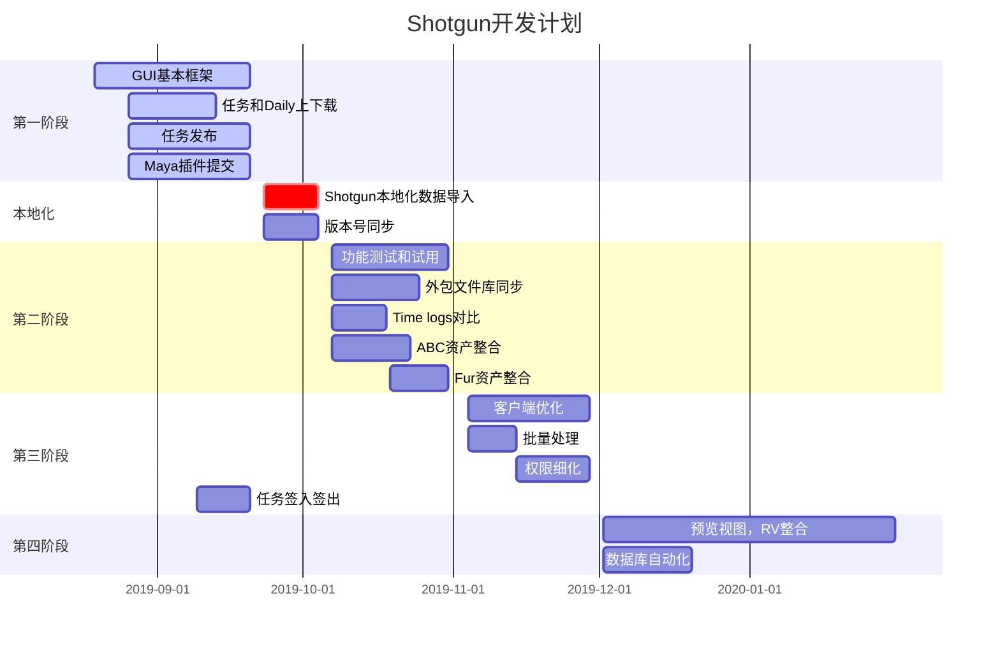

Shotgun开发计划

第一阶段：

8-9月

GUI基本框架；

任务和Daily上下载基本功能；

任务发布；

Maya插件提交；

工时申报，time logs

本地化

1周

Shotgun本地化数据导入；

版本号同步；

第二阶段：

10月

第一版测试优化；

外包文件库同步；

Time log对比；

ABC资产整合；

第三阶段：

11月

客户端优化；

批量处理；

权限管理细化

第四阶段：

12月

预览视图；

RV整合；

服务器数据库自动化

